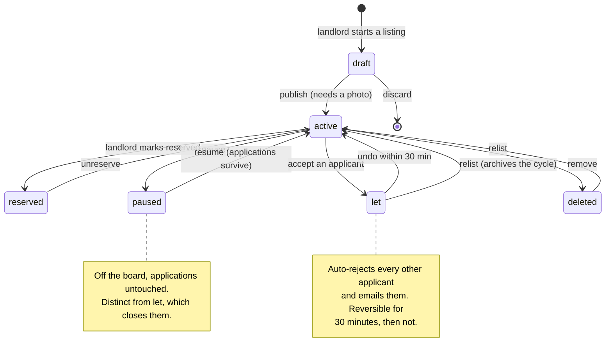
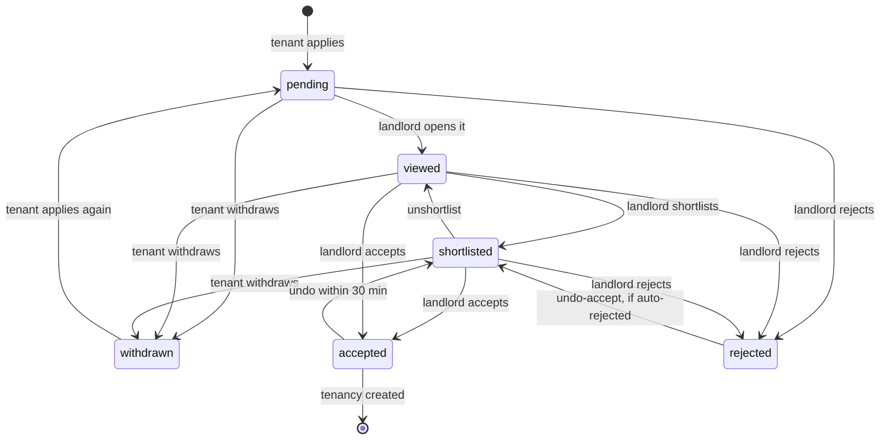
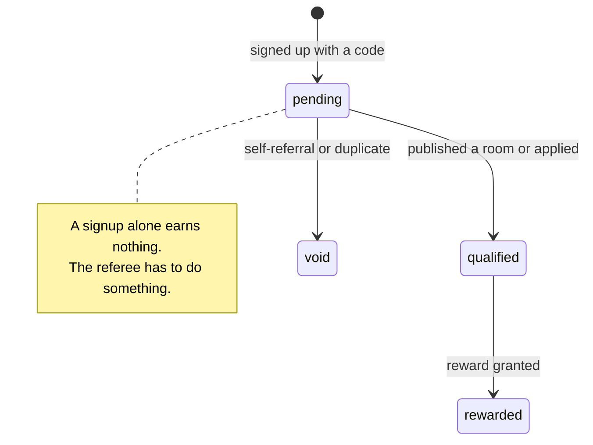
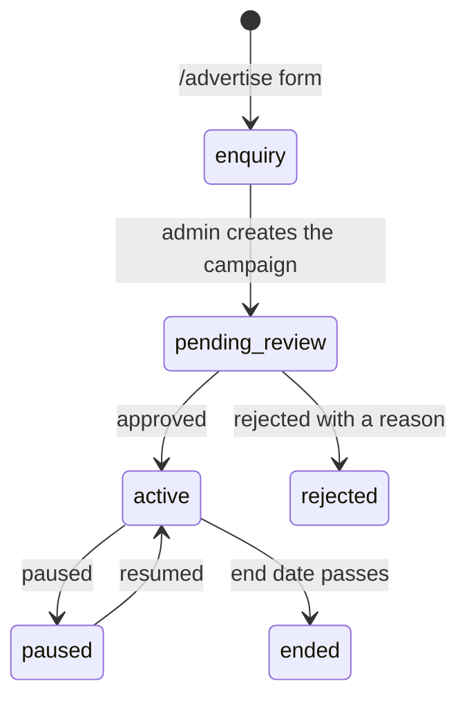

# Flow map

Generated by `node scripts/route-audit.mjs --write`. Do not edit by hand — it
is derived from the routes, guards and schema, so it cannot drift from the code.

Last generated: 2026-09-07

---

## Room lifecycle

States: draft, active, reserved, let, paused, deleted



## Application lifecycle

States: pending, viewed, shortlisted, accepted, rejected, withdrawn



## Where each ends up on the tenant dashboard

Every application belongs to exactly one section.

| Section | Rule |
|---|---|
| Your applications | not archived, not withdrawn, not rejected |
| Available again | archived, room is active again, no current application |
| Closed applications | withdrawn, rejected, or archived on an unavailable room |

## Referral lifecycle

States: pending, qualified, rewarded, void



## Advertising pipeline

States: 



## Route map

### app.routes.ts

| Path | Component | Guards |
|---|---|---|
| `rooms/:id` | RoomDetail |  |
| `auth` | AUTH_ROUTES |  |
| `legal` | LEGAL_ROUTES |  |
| `tenant` | TENANT_ROUTES | authGuard, tenantGuard |
| `landlord` | LANDLORD_ROUTES | authGuard, landlordGuard |
| `account` | ACCOUNT_ROUTES | authGuard |
| `admin` | ADMIN_ROUTES | authGuard, adminGuard |
| `**` | ErrorPage |  |

### features:account/account.routes.ts

| Path | Component | Guards |
|---|---|---|
| `settings` | → settings |  |

### features:admin/admin.routes.ts

| Path | Component | Guards |
|---|---|---|
| `dashboard` | AdminDashboard |  |
| `verifications` | AdminVerifications |  |
| `reports` | AdminReports |  |
| `advertising` | AdminAdvertising |  |
| `referrals` | AdminReferrals |  |
| `analytics` | AdminAnalytics |  |
| `users/:id` | → dashboard |  |

### features:auth/auth.routes.ts

| Path | Component | Guards |
|---|---|---|
| `login` | Login |  |
| `register` | Register |  |
| `magic` | MagicLink |  |
| `forgot-password` | ForgotPassword |  |
| `reset-password` | ResetPassword |  |
| `callback` | → login |  |

### features:landlord/landlord.routes.ts

| Path | Component | Guards |
|---|---|---|
| `dashboard` | LandlordDashboard |  |
| `rooms/new` | CreateRoom |  |
| `rooms/:roomId/edit` | CreateRoom |  |
| `rooms/:roomId/applicants` | Applicants |  |
| `verification` | LandlordVerification |  |
| `upgrade` | → dashboard | billingEnabledGuard |

### features:legal/legal.routes.ts

| Path | Component | Guards |
|---|---|---|
| `(index)` | → privacy |  |
| `privacy` | PrivacyPolicy |  |
| `terms` | Terms |  |
| `disclaimer` | Disclaimer |  |
| `cookies` | Cookies |  |
| `paia` | Paia |  |

### features:pages/pages.routes.ts

| Path | Component | Guards |
|---|---|---|
| `how-it-works` | HowItWorks |  |
| `advertise` | Advertise |  |
| `pricing` | Pricing |  |

### features:tenant/tenant.routes.ts

| Path | Component | Guards |
|---|---|---|
| `dashboard` | TenantDashboard |  |
| `passport` | → dashboard | billingEnabledGuard |

## Public API surface

Everything below is reachable without a token. Each one should be
deliberate — check this list when adding an endpoint.

- `GET /ads`
- `POST /ads/impressions`
- `GET /ads/:id/click`
- `GET /ads/rates`
- `POST /ads/enquiries`
- `POST /analytics/event`
- `POST /auth/register`
- `POST /auth/login`
- `GET /auth/google`
- `POST /auth/refresh`
- `POST /auth/logout`
- `POST /auth/magic-link`
- `POST /auth/magic-link/verify`
- `POST /auth/phone/request-code`
- `POST /auth/phone/verify`
- `POST /auth/forgot-password`
- `POST /auth/reset-password`
- `POST /auth/confirm-email-change`
- `GET /health`
- `POST /notifications/webhook/resend`
- `POST /payments/payfast/notify`
- `GET /places/suggest`
- `GET /places/resolve`
- `GET /referrals/validate`
- `GET /reviews/room/:roomId`
- `GET /reviews/landlord/:landlordId`
- `GET /rooms`
- `GET /rooms/suggest`
- `GET /robots.txt`
- `GET /sitemap.xml`
- `POST /stripe/webhook`
- `GET /whatsapp/webhook`
- `POST /whatsapp/webhook`

---

## How each layer is verified

Three layers, each catching what the others cannot.

| Layer | Command | Covers | Blind to |
|---|---|---|---|
| Route audit | `node scripts/route-audit.mjs` | Routes resolve, guards present, links valid | Anything at runtime |
| API smoke test | `./scripts/smoke-test.sh` | ~340 endpoint assertions, permissions, state transitions | Everything visual |
| Browser tests | `npm run e2e` | The journeys where being wrong costs a user something | Everything not written down |

**The middle layer passed through every UI bug found in the last two weeks.**
A withdrawn application filed under the wrong heading, a saved phone number
that never displayed, a missing FormsModule, checkboxes stacked above their
labels — 340 API assertions, none of them caught it. That is not a flaw in the
API tests; those bugs simply are not visible from the API.

### Running the browser tests

```bash
npm install
npm run e2e:install     # once, downloads Chromium
# with both servers running:
npm run e2e
npm run e2e:ui          # interactive, for writing new ones
```

### What is covered, and why those

Each spec exists because that exact flow broke:

- **application-lifecycle** — withdraw, then re-apply. Broken three ways at
  once: it stayed under 'Your applications', re-applying was blocked by the
  unique constraint, and an old archived row resurfaced under 'Available again'
- **account-settings** — a saved phone number surviving sign-out. Broken twice,
  in two places, and both times the save worked while the form showed nothing
- **listing-wizard** — editing must not duplicate a listing. Paging forward
  through an edit used to create a second one
- **board.mobile** — filters on one row, a room card above the fold, a checkbox
  beside its label. All three regressed at phone width while looking fine on a
  desktop

### What is deliberately not covered

Browser tests are slow and go stale, so this is a small suite by choice.
Payments, email delivery, WhatsApp and the admin portal are left out: they
depend on third parties or on data that is awkward to set up, and the API tests
already cover their logic. If a flow here breaks twice, add a spec for it —
that is the rule that produced the four above.
